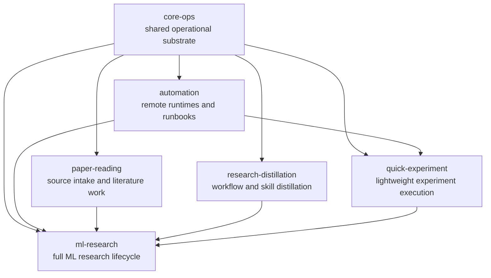

# skill-os

> The hub of a portable agent **Skill OS** matrix for AI research workflows.
> Defines the rules; the profile-pack repos hold the skills.

`skill-os` is the framework / source-of-truth-for-rules repo that sits on top
of a constellation of agent-skill profile packs. It owns:

- **Kernel schema** — `schemas/skill-kernel/skill-kernel.schema.json` and the
  portable kernel example shape used across all packs
- **Install / repo-split handoff contract** — the reviewed boundary that
  blocks unreviewed runtime writes; active contract at
  `schemas/skill-kernel/install-handoff-contract-2026-05-28.json`
  (`reviewed-execute-enabled`); frozen `2026-05-27` pre-revision preserved
  for refusal regression
- **Install-plan schema and validator** —
  `schemas/skill-kernel/install-plan.schema.json` plus
  `scripts/validate_install_handoff_plan.py` (multi-root resolution via
  `--source-root` for cross-repo installs since ACT-082)
- **Read-only previews** for project-local install + repo-split scaffold
  actions, with content-hash and rollback record templates
- **Real installer and scaffolder** — `scripts/apply_install_plan.py` and
  `scripts/apply_repo_split.py`; refuse known global skill roots; require
  `--execute` and an authorized contract
- **Chain installer** (ACT-081) — `scripts/install_profile_chain.py`:
  resolves a profile's transitive `depends_on` chain via
  `scripts/resolve_profile_dependencies.py` and drives `apply_install_plan.py`
  per step. Pulls all sibling packs in dependency-first order with one
  command.
- **Matrix registry** — `profiles/profile-index.yaml`, listing every
  profile-pack repo by `github_url` + `pinned_commit` + `depends_on`
- **Pack pin verifier** (ACT-086) — `scripts/verify_pack_pins.py`: read-only,
  compares local sibling-pack HEADs to the matrix's pinned commits and exits
  non-zero on mismatch. Never auto-checks-out the pinned ref.
- **Design doc** — `docs/design/skill-matrix.md`

## Matrix (7 repos, all live on GitHub)

| Profile | Repo | Skills | Depends on |
|---|---|---|---|
| `core-ops` | [core-ops-skills](https://github.com/a-green-hand-jack/core-ops-skills) | 12 | — |
| `automation` | [automation-skills](https://github.com/a-green-hand-jack/automation-skills) | 6 | `core-ops` |
| `paper-reading` | [paper-reading-skills](https://github.com/a-green-hand-jack/paper-reading-skills) | 11 | `core-ops` |
| `research-distillation` | [research-distillation-skills](https://github.com/a-green-hand-jack/research-distillation-skills) | 13 | `core-ops` |
| `quick-experiment` | [quick-experiment-skills](https://github.com/a-green-hand-jack/quick-experiment-skills) | 9 | `core-ops` + `automation` |
| `ml-research` | [ml-research-skills](https://github.com/a-green-hand-jack/ml-research-skills) | 46 (after 2026-05-28 hard-slim) | all 5 above |

`global-bootstrap` is a thin entrypoint pack and stays inside
`ml-research-skills` for now.

## How the packs relate

The matrix is graph-shaped, not a flat skill list:



Each profile exposes one or more router skills, and those routers dispatch to
leaf skills that do the work:

| Profile | Router / entrypoint | Typical leaf skills |
|---|---|---|
| `core-ops` | `project-ops-router` | `safe-git-ops`, `research-project-memory`, `update-docs`, `sidecar-task-runner` |
| `automation` | `project-ops-router` | `remote-project-control`, `run-status-monitor`, `token-usage-auditor` |
| `paper-reading` | `discovery-router` | `reference-library-manager`, `reference-reading-summarizer`, `reference-corpus-analyzer`, `reference-project-synthesizer` |
| `research-distillation` | `discovery-router` | `memory-publication-auditor`, `skill-system-auditor`, `personalization-memory` |
| `quick-experiment` | `experiment-evidence-router` | `run-experiment`, `experiment-debugger`, `compute-budget-planner`, `result-diagnosis`, `data-pipeline-manager` |
| `ml-research` | `ml-research-router`, `paper-writing-router` | `research-idea-validator`, `algorithm-design-planner`, `paper-writing-assistant`, `rebuttal-strategist`, `submit-paper` |

## Quickstart — install into a project

```bash
# 1. Clone skill-os + every pack repo your project needs (or use the chain
#    installer to do it after a one-time `--pack-search-path` setup).
git clone https://github.com/a-green-hand-jack/skill-os.git
git clone https://github.com/a-green-hand-jack/core-ops-skills.git
git clone https://github.com/a-green-hand-jack/paper-reading-skills.git
# ...

# 2. Run the chain installer for your folder type. The chain resolves
#    depends_on automatically.
python3 skill-os/scripts/install_profile_chain.py paper-reading \
  --target-parent /path/to/my-paper-reading-folder/.agents/skills \
  --pack-search-path /path/to/cloned-pack-parent \
  --execute

# Result (two-layer layout):
#   .agents/skills/
#     core-ops/SKILL.md         <- profile-level kernel adapter, 1 per pack
#     paper-reading/SKILL.md    <-
#     <skill-name>/SKILL.md     <- flat leaf skill (one dir per unique skill)
#     <skill-name>/references/
#     ...
#     .skill-os-install-state/  <- plans + manifest indexes + rollback records
#
# For `ml-research` (depends_on all 5 packs): 6 profile adapters + 74 flat
# leaf-skill dirs (cross-pack dedup is first-wins by depends_on order).
# Use --no-leaf-skills if you only want the profile adapters.
```

The chain installer prints JSON. Its `install_report` section summarizes the
profiles applied, suggested entrypoints, leaf-skill counts, first-wins dedup
skips, and per-pack source paths so multi-repo installs are auditable.

The chain installer respects the active handoff contract: it refuses to write
known global skill roots (`~/.codex/skills`, `~/.agents/skills`,
`~/.claude/skills`) regardless of contract state, and refuses every step
without `--execute`.

## Folder-shape install recipes

Common folder types and what to install:

| Folder type | Install chain | Total skills |
|---|---|---|
| Pure paper-reading folder | `paper-reading` | 23 (core-ops + paper-reading) |
| Remote ops / cluster maintenance | `automation` | 18 (core-ops + automation) |
| Quick scratchpad experiment | `quick-experiment` | 27 (core-ops + automation + quick-experiment) |
| Research distillation | `research-distillation` | 25 (core-ops + research-distillation) |
| Full ML research project | `ml-research` | 97 (core-ops + automation + paper-reading + research-distillation + quick-experiment + ml-research) |

Common work scenarios and their starting profiles:

| Scenario | Start with | Typical route |
|---|---|---|
| Read one paper | `paper-reading` | `discovery-router` → `reference-reading-summarizer` |
| Run a focused literature review | `paper-reading` | `discovery-router` → `literature-review-sprint` / `reference-corpus-analyzer` |
| Reproduce another project's code or experiments | `paper-reading` + `quick-experiment` | source understanding via `reference-reading-summarizer`; execution via `experiment-evidence-router` → `run-experiment` / `experiment-debugger` |
| Maintain remote jobs, clusters, or runbooks | `automation` | `project-ops-router` → `remote-project-control` / `run-status-monitor` |
| Test a small AI idea or scratch experiment | `quick-experiment` | `experiment-evidence-router` → `experiment-design-planner` / `compute-budget-planner` / `run-experiment` |
| Grow a scratch experiment into a paper-grade project | `ml-research` | `ml-research-router` → idea, method, experiment, evidence, and writing skills |
| Write or revise a paper | `ml-research` | `paper-writing-router` → `paper-writing-contract-planner` / `paper-writing-assistant` / `paper-draft-consistency-editor` |
| Respond to reviews or prepare camera-ready artifacts | `ml-research` | `ml-research-router` → `rebuttal-strategist` / `camera-ready-finalizer` / `artifact-evaluation-prep` |

See `docs/usage/profile-selection-guide.md` for the full decision tree and
promotion rules.

## Status

| Phase | What landed | When |
|---|---|---|
| Phase B1 | skill-os hub created from ml-research-skills (kernel + scripts + registry + design + memory). 29 tests. | 2026-05-28 |
| ACT-080 | Synthetic-pack fixture + 9 chain tests. Refactor `inventory_profile_for_split` + `apply_repo_split` to accept `--source-root`. | 2026-05-28 |
| ACT-082 | Multi-root resolution in `validate_install_handoff_plan` + threaded `--source-root` through preview/apply scripts. Cross-repo install verified end-to-end against cloned packs. | 2026-05-28 |
| ACT-081 | Chain installer `install_profile_chain.py` + 4 chain tests. End-to-end validation: cloned 3 packs → quick-experiment chain installed in one command. | 2026-05-28 |
| ACT-083 | Hard-slim ml-research-skills: 28 skill dirs removed there + explicit `depends_on` declared. Net -15,442 lines in that repo. | 2026-05-28 |
| ACT-084 | Relocated `profiles/research-distillation/` subtree from ml-research-skills to research-distillation-skills. | 2026-05-28 |
| ACT-085 | Matrix-wide leaf-routing regression fixture rehomed here as `tests/routing-evals.json` + `tests/test_routing_evals.py`. | 2026-05-28 |
| ACT-086 | Pinned commit per sibling pack in `profile-index.yaml` + `scripts/verify_pack_pins.py` read-only mismatch detector. | 2026-05-28 |
| Post-Phase-B2 consistency | Hub validator matrix-aware (`--pack-search-path`); `--pack NAME=PATH` in chain installer; ml-research profile gains `depends_on`; 5 pack profiles flip `draft`→`active`; doc/memory drift purged. | 2026-05-28 |
| Leaf-skill staging | Chain installer adds Phase-2 leaf-flat copy per pack with first-wins dedup. `chain_install ml-research` now lands 6 profile adapters + 74 unique leaf SKILL.md dirs. | 2026-05-28 |

Test count: **69 passing** in skill-os.

## Source-of-truth boundaries

- **Kernel schema, install/repo-split contract, schemas/plan/write-action schemas, design doc, profile-index registry, validators, installer, scaffolder, chain installer** — live HERE (skill-os). Edit here.
- **Skill files** (`SKILL.md` and bundled resources) — live in each PACK repo. The kernel example inside each pack repo is the authoritative kernel for that pack.
- **Reference kernel examples** under `schemas/skill-kernel/examples/` here — copies for documentation and adapter-export dry-runs. The pack's own copy is canonical.

## Validation

```bash
# One-command matrix validation (hub + sibling packs, read-only)
python3 scripts/validate_matrix.py --pack-search-path <parent-of-cloned-packs>

# Adapter-export dry-run check (no fixture needed)
python3 scripts/export_skill_kernel_adapters.py --runtime all --check

# Full test suite (synthetic-fixture-based, no real packs needed)
python3 -m unittest discover tests

# Deep taxonomy / profile / kernel schema consistency check.
# In skill-os, pass pack paths because skills/ is intentionally empty here.
uv run scripts/validate_skill_taxonomy.py --pack-search-path <parent-of-cloned-packs>

# Verify local sibling-pack clones match profile-index pinned commits
python3 scripts/verify_pack_pins.py --pack-search-path <parent-of-cloned-packs>
```

Use `--pack NAME=PATH` with `validate_matrix.py`, `validate_skill_taxonomy.py`,
or `verify_pack_pins.py` when a sibling pack clone has a non-canonical local
directory name. `validate_matrix.py` accepts either the profile name
(`ml-research`) or repo name (`ml-research-skills`) for overrides.

## License and use

Public on GitHub. PRs and issues welcome. Generated kernel + adapter
output is always marked `dry_run: true` until a reviewed install plan and
an authorized contract say otherwise. Read the contract before writing.
