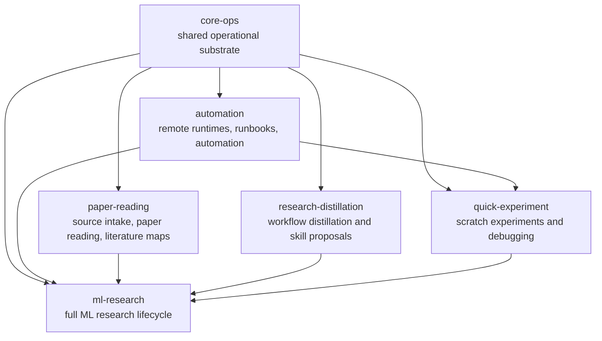

# Skill Matrix Design

This document defines the direction for evolving `ml-research-skills` from one
large ML research bundle into a portable matrix of skill-pack repositories.

## Goal

Build a skill system that can preserve and transfer reusable work methods across
projects, agent runtimes, and domains. The system should support an AI PhD
student's research, learning, paper reading, project automation, and future
domains without requiring every skill to be installed globally.

The central design rule is:

> Project profile first, skill list second.

Agents should determine the project profile, load the relevant pack, and then
route within that pack. They should not search one global list of every skill
the user has ever accumulated.

## Relationship Model

The matrix has three layers:

1. **Profile packs** define project shape, install scope, and dependencies.
2. **Router skills** choose the appropriate workflow inside a profile.
3. **Leaf skills** perform the concrete work.

The profile-pack layer is intentionally graph-shaped:



`core-ops` is the substrate: memory, git, documentation, sidecars, validation,
workspace handling, and safe closeout. `automation`, `paper-reading`,
`research-distillation`, and `quick-experiment` add domain-specific capability
without forcing a full ML research install. `ml-research` is the assembly layer:
it depends on all five sibling packs and adds paper-grade research planning,
writing, review, rebuttal, submission, and release workflows.

At runtime the graph becomes a routing tree. A prompt should first select the
smallest fitting profile, then enter the profile's router, then land on a leaf
skill:

```mermaid
graph TD
  ProjectOps[project-ops-router]
  Discovery[discovery-router]
  Experiment[experiment-evidence-router]
  MLRouter[ml-research-router]
  PaperWriting[paper-writing-router]

  Core[core-ops] --> ProjectOps
  ProjectOps --> Git[safe-git-ops]
  ProjectOps --> Memory[research-project-memory]
  ProjectOps --> Docs[update-docs]
  ProjectOps --> Sidecar[sidecar-task-runner]

  Automation[automation] --> ProjectOps
  ProjectOps --> Remote[remote-project-control]
  ProjectOps --> Status[run-status-monitor]

  Paper[paper-reading] --> Discovery
  Discovery --> Library[reference-library-manager]
  Discovery --> Read[reference-reading-summarizer]
  Discovery --> Corpus[reference-corpus-analyzer]
  Discovery --> Synthesis[reference-project-synthesizer]

  Distill[research-distillation] --> Discovery
  Discovery --> Publication[memory-publication-auditor]
  Discovery --> SkillAudit[skill-system-auditor]
  Discovery --> Personal[personalization-memory]

  Quick[quick-experiment] --> Experiment
  Experiment --> Design[experiment-design-planner]
  Experiment --> Budget[compute-budget-planner]
  Experiment --> Run[run-experiment]
  Experiment --> Monitor[run-status-monitor]
  Experiment --> Debug[experiment-debugger]
  Experiment --> Diagnose[result-diagnosis]

  ML[ml-research] --> MLRouter
  ML[ml-research] --> PaperWriting
  MLRouter --> Idea[research-idea-validator]
  MLRouter --> Algorithm[algorithm-design-planner]
  MLRouter --> Rebuttal[rebuttal-strategist]
  MLRouter --> Release[artifact-evaluation-prep]
  PaperWriting --> Contract[paper-writing-contract-planner]
  PaperWriting --> Draft[paper-writing-assistant]
  PaperWriting --> Review[paper-reviewer-simulator]
  PaperWriting --> Submit[submit-paper]
```



The chain installer materializes both layers in a project-local root:
profile-level adapters such as `core-ops/SKILL.md` and flat leaf-skill
directories such as `experiment-debugger/SKILL.md`. If the same leaf skill name
appears in multiple packs, the dependency order is first-wins so foundational
packs keep ownership of shared substrate skills.

## Scenario Map

Common project situations should map to profiles before mapping to individual
skills:

| Scenario | Recommended profile | Entry route | Typical leaf skills |
|---|---|---|---|
| Ordinary project maintenance | `core-ops` | `project-ops-router` | `safe-git-ops`, `research-project-memory`, `update-docs`, `sidecar-task-runner` |
| Read a single paper | `paper-reading` | `discovery-router` | `reference-reading-summarizer`, `reference-project-synthesizer` |
| Run a focused literature review | `paper-reading` | `discovery-router` | `literature-review-sprint`, `reference-corpus-analyzer`, `citation-coverage-audit` |
| Manage a reading group or paper folder | `paper-reading` | `discovery-router` | `reference-library-manager`, `reference-reading-summarizer`, `reference-corpus-analyzer` |
| Distill a strong paper, repo, course, or workflow into reusable practice | `research-distillation` | `discovery-router` | `reference-reading-summarizer`, `memory-publication-auditor`, `skill-system-auditor`, `personalization-memory` |
| Reproduce another project's code or experiments | `paper-reading` + `quick-experiment` | `discovery-router` then `experiment-evidence-router` | `reference-reading-summarizer`, `data-pipeline-manager`, `run-experiment`, `run-status-monitor`, `experiment-debugger`, `experiment-report-writer` |
| Maintain remote jobs, clusters, storage, or runbooks | `automation` | `project-ops-router` | `remote-project-control`, `run-status-monitor`, `token-usage-auditor` |
| Quickly test an AI idea | `quick-experiment` | `experiment-evidence-router` | `experiment-design-planner`, `compute-budget-planner`, `run-experiment`, `result-diagnosis` |
| Build a small AI project before it becomes paper-grade | `quick-experiment`, then promote to `ml-research` if claims mature | `experiment-evidence-router` | `data-pipeline-manager`, `experiment-design-planner`, `experiment-debugger`, `experiment-report-writer` |
| Run a paper-grade ML research project | `ml-research` | `ml-research-router` | `research-idea-validator`, `algorithm-design-planner`, `experiment-design-planner`, `paper-evidence-board`, `paper-writing-router` |
| Write or revise a paper | `ml-research` | `paper-writing-router` | `paper-writing-contract-planner`, `paper-writing-assistant`, `method-section-explainer`, `experiment-story-writer`, `paper-draft-consistency-editor` |
| Prepare submission, rebuttal, camera-ready, or artifact release | `ml-research` | `ml-research-router` / `paper-writing-router` | `paper-reviewer-simulator`, `auto-paper-improvement-loop`, `rebuttal-strategist`, `submit-paper`, `camera-ready-finalizer`, `artifact-evaluation-prep`, `model-card-writer`, `release-code` |

Representative routes:

```text
Read a paper:
paper-reading -> discovery-router -> reference-reading-summarizer -> reference-project-synthesizer

Reproduce an experiment:
paper-reading -> discovery-router -> reference-reading-summarizer
quick-experiment -> experiment-evidence-router -> data-pipeline-manager -> run-experiment -> run-status-monitor -> experiment-debugger -> experiment-report-writer

Test a small AI idea:
quick-experiment -> experiment-evidence-router -> experiment-design-planner -> compute-budget-planner -> run-experiment -> result-diagnosis

Run a paper-grade project:
ml-research -> ml-research-router -> research-idea-validator -> algorithm-design-planner -> experiment-design-planner -> paper-evidence-board -> paper-writing-router
```

## Source Of Truth

Workflow knowledge should remain agent-neutral:

- `SKILL.md` and linked references hold human-readable procedure.
- `profiles/profile-index.yaml` defines install and routing profiles.
- `schemas/skill-kernel/skill-kernel.schema.json` defines the minimum portable
  kernel for profile identity, routing, action/evidence lane contracts,
  validation, memory, adapter metadata, and promotion gates.
- `profiles/<profile-name>/` can hold profile-local templates, examples, and
  docs before a workflow is mature enough to become a separate skill pack.
- `taxonomy/skill-index.yaml` defines skill taxonomy inside this repo.
- `tests/routing-evals.json` preserves routing regression examples.
- `tests/profile-routing-evals.json` preserves profile-selection examples.
- `scripts/score_profile_routing.py` scores actual runtime/agent profile
  predictions against profile-selection examples.
- `scripts/export_skill_kernel_adapters.py` exports dry-run runtime adapter
  metadata, preview skill-root fixtures, and review-gated installable manifest
  prototypes from checked skill-kernel examples while preserving the kernel as
  the source of truth.
- `scripts/validate_install_handoff_plan.py` checks reviewed install/repo-split
  plans against the handoff contract and generated manifest index without
  writing runtime files.
- `schemas/skill-kernel/runtime-adapter-contracts.json` records observed
  Codex/Claude skill-directory expectations used by adapter and manifest
  prototypes.
- `schemas/skill-kernel/core-ops-runtime-semantics-2026-05-27.json` records
  the first resolved runtime selection semantics for `core-ops`.
- `taxonomy/memory-contracts/` defines memory read/write requirements.
- `scripts/validate_*.py` encode mechanical consistency checks.
- Templates and helper scripts carry reusable artifacts.

Codex, Claude Code, Cursor, or future agent runtime metadata should be adapter
outputs or thin wrappers around this source material, not the only copy of the
workflow logic.

## Repository Matrix

| Repo | Status | Purpose |
|---|---|---|
| `skill-kernel` | proposed | Shared schema, profile manifest rules, validators, memory contracts, routing eval conventions, and runtime adapters. Current seed lives in `schemas/skill-kernel/`. |
| `core-ops-skills` | proposed | Cross-project operations: memory, git closeout, artifact hygiene, docs, sidecars, validation, environment and storage boundaries. |
| `ml-research-skills` | active | Current AI PhD / ML research domain pack from idea to paper, experiments, rebuttal, artifact release, and project memory. |
| `paper-reading-skills` | proposed | Reading-only projects, source intake, source cards, paper comparison, and literature maps without full experiment/paper machinery. |
| `research-distillation-skills` | proposed | Distill excellent papers, projects, people, courses, and workflows into pattern cards and skill proposals. |
| `automation-skills` | proposed | Codex-driven automation, runbooks, scheduled probes, monitors, rollback plans, and credential-safe orchestration. |
| `private-overlays` | private | Local paths, accounts, preferences, unpublished project facts, and personal memory that must not be published directly. |

## Profile Contract

Each profile in `profiles/profile-index.yaml` must define:

- `status`: `active`, `draft`, or `deprecated`
- `scope`: `global`, `project-local`, `cross-domain`, or `private`
- `intent`: one clear description of when this profile exists
- `entrypoints`: one or more real skills that start routing for the profile
- `skills.required`: skills required for the profile to work
- `skills.optional`: useful but non-required skills
- `install_policy.recommended`: `global`, `project-local`, `maintainer-debug`, or `private`
- `install_policy.full_bundle_allowed`: whether all repo skills may be installed for this profile
- `include_all_repo_skills`: required when `install_policy.full_bundle_allowed`
  is `true`; keeps full-bundle installs explicit at the profile boundary

Draft profiles must also set `future_repo` so extraction targets stay explicit.
Future missing capabilities belong in `gaps`, not as fake skill names.

`uv run scripts/validate_skill_taxonomy.py` enforces the current profile schema.

## Active Profiles

`global-bootstrap` is the only global-facing profile. It keeps global installs
thin and routes possible ML research projects into `ml-research-bootstrap`.

`ml-research` is the current full production profile. It is project-local and
may include all repo skills inside an initialized ML research project or this
maintainer repo.

## Draft Profiles

`core-ops` collects cross-domain operational skills. This should be the first
candidate for extraction because many project types need memory, git, docs,
artifact hygiene, sidecars, and validation without ML-specific claims.

`paper-reading` collects reference-library, source-card, corpus, and literature
mapping workflows for reading-only projects.

`research-distillation` turns strong external sources into reusable work
patterns. Its intended pipeline is:

```text
source card -> pattern card -> skill proposal -> routing eval -> skill patch
```

The initial profile-local artifact loop lives under
`profiles/research-distillation/` and provides distillation-run, pattern-card,
and skill-proposal templates plus examples. The first real public-source trial
uses ByteDance UI-TARS to distill agent action-contract and trajectory-reflection
patterns. The second real public-source trial uses Alibaba / Tongyi
DeepResearch to distill search-agent training-ladder and heavy/light mode
patterns, then compares those against the UI-TARS `agent-action-contract-reviewer`
proposal. The combined profile-local proposal,
`agent-workflow-contract-planner`, now records the shared action/evidence
contract before any standalone skill is created. Its template and profile-local
fixtures now test action-only, evidence-only, combined, and no-contract lanes.
Two filled real-task trials show the contract is currently better treated as a
portable schema and preflight artifact than as a standalone executor skill.

`automation` captures agent-driven scripts and runbooks. It should stay
conservative around credentials, destructive actions, and unattended execution.

## Migration Order

1. Keep `ml-research-skills` as the mature active pack.
2. Keep the minimum `skill-kernel` schema passing validation before repo splits.
3. Harden profile validation until profiles cannot silently drift.
4. Use profile-level routing evals for `global-bootstrap`, `paper-reading`,
   `research-distillation`, and `automation` before adding runtime adapters.
5. Extract `core-ops-skills` only after the shared profile contract is stable.
6. Trial `paper-reading-skills` or `research-distillation-skills` as the first
   non-ML domain pack.
7. Add runtime adapters only after the source schema is stable enough to avoid
   copying logic separately into each agent runtime.

## Minimum Skill Kernel

The first portable kernel schema lives in `schemas/skill-kernel/`. A kernel is
not a full skill and not an agent-runtime manifest. It is the smallest
cross-repo contract that must survive profile extraction:

- identity: schema version, kernel id, owner repo, and source paths
- profile: name, status, scope, intent, and future repo when draft
- routing: entrypoints, routers, and handoff policy
- install policy: recommended install scope and full-bundle gate
- skill membership: required and optional skills
- workflow contract: action, evidence, combined, and no-contract lanes
- validation: required commands plus acceptance checks
- memory: required reads, writeback targets, and privacy boundary
- adapters: runtime metadata targets that do not own source truth, including
  selection semantics for direct entrypoints, profile-first entrypoints,
  substrate/delegators, and schema-only contracts
- promotion: gates and rejection checks before creating a skill or repo

The current examples are:

- `schemas/skill-kernel/examples/core-ops.kernel.json`
- `schemas/skill-kernel/examples/paper-reading.kernel.json`
- `schemas/skill-kernel/examples/research-distillation-workflow-contract.kernel.json`

Together they exercise action/combined-heavy operations, evidence-heavy reading,
and research-distillation promotion boundaries without adding profile-specific
schema fields. This keeps the next repo split tied to checked artifacts rather
than prose-only design notes.

`scripts/export_skill_kernel_adapters.py` now provides the first dry-run adapter
step. It can export Codex, Claude Code, Cursor, and generic-agent-shaped
metadata from these kernels, but every output is marked `dry_run: true` and
`installable: false`. The adapter layer is therefore an inspection boundary, not
a new workflow source of truth. The first runtime contract comparison is now
explicit: Codex and Claude Code both require `SKILL.md` frontmatter with `name`
and `description`; `agents/openai.yaml` is an optional OpenAI/interface metadata
surface where supported; workflow, validation, memory, install policy, and
promotion fields remain docs-only in the adapter. The exporter can also write
temporary preview skill roots under `<root>/<runtime>/<skill-name>/` and
smoke-check generated `SKILL.md` fixtures before any installable adapter exists.
The first runtime capture confirms that these previews enter Codex and Claude
Code prompt surfaces. Codex selected `paper-reading` and
`research-distillation-workflow-contract` for matching profile prompts, but a
general `core-ops` maintenance prompt still routed to mature leaf skills such
as `project-ops-router`, `safe-git-ops`, and `update-docs`. The follow-up
semantics capture resolves this as the intended contract: `core-ops` is a
profile-first entrypoint for isolated installs or runtimes that enforce
profile-first selection, and it may delegate to mature owner skills when the
full shared root is visible.

The exporter also writes review-gated installable manifest prototypes under
`<root>/<runtime>/<skill-name>/adapter-manifest.json`, plus an
`installable-manifest-index.json`. These manifests are deliberately not
installers: they set `safe_to_install_automatically: false`, require manual
review, preserve `selection_semantics`, and keep workflow, validation, memory,
install policy, and promotion as non-authoritative kernel fields rather than
runtime-owned truth. The same exporter can re-read those manifests into a
temporary session-only skill root with `--exercise-skill-root`, writing
runtime-like `SKILL.md` files and a `manifest-exercise-summary.json` that
records `global_install_modified: false`.

The manifest-exercise runtime capture closes the last pre-install behavior
check. Codex sees the exercised roots and, in an empty isolated workdir, selects
`core-ops` for operational closeout, `paper-reading` for reading-only work, and
`research-distillation-workflow-contract` for public-source distillation. In the
full repo root, maintenance prompts still route to mature owner skills such as
`project-ops-router`, which is the desired delegation behavior. Claude Code
loads all three exercised skills through a session-only plugin and shows them in
the skill prompt; local CLI auth still blocks model-choice capture.

The reviewed install/repo-split handoff contract turns that capture into a
harder boundary. The active contract
`schemas/skill-kernel/install-handoff-contract-2026-05-28.json` is
`reviewed-execute-enabled`: it authorizes the real installer and repo-split
scaffolder for `project-local-profile-install` and `repo-split-handoff` modes
through reviewed plans. `global-bootstrap-install` and
`maintainer-debug-global-install` remain disabled by default and require
explicit user request per invocation. The pre-revision
`schemas/skill-kernel/install-handoff-contract-2026-05-27.json` is preserved as
`status: superseded` for refusal regression coverage. A valid plan must name
the target root, profile, runtime, source-of-truth files, validation checks,
privacy/publication audit, selection-semantics preservation, and rollback
record.

`scripts/validate_install_handoff_plan.py` makes the review boundary
mechanical. It consumes `schemas/skill-kernel/install-plan.schema.json`, the
active handoff contract, and a generated `installable-manifest-index.json`;
then it reports whether the plan satisfies review gates, source truth,
global-root policy, privacy, rollback, validation commands, and
manifest/profile alignment. `scripts/preview_install_writer.py` and
`scripts/preview_repo_split_writer.py` enumerate the exact write actions
(`create-directory`, `write-skill-markdown`, `write-interface-metadata`,
`copy-file`, `write-profile-index-slice`, `post-write-check`) a future
executor would emit without writing anything themselves; their output schema
lives at `schemas/skill-kernel/write-actions.schema.json`.
`scripts/apply_install_plan.py` and `scripts/apply_repo_split.py` then execute
those action lists against the active contract, with explicit `--execute`
gating, rollback records, and an unconditional refusal of any target under
known global skill roots.

## Self-Evolution Loop

The system should improve by promoting repeated experience through explicit
gates:

```text
usage trace
-> lesson
-> preference
-> project convention
-> reusable pattern
-> skill rule
-> routing eval / validator check
```

Do not promote raw transcripts or private facts directly into public skills.
Use `memory-publication-auditor` when extracting public knowledge from private
memory, private skills, or personal operational logs.

## Near-Term Work

- Use `scripts/score_profile_routing.py` to score actual Codex/Claude/runtime
  profile choices against `tests/profile-routing-evals.json` before adding
  runtime adapters.
- Exercise the non-mutating install-plan validator on concrete `core-ops`
  project-local install and repo-split plan fixtures before enabling real
  install automation or starting a destination repo.
- Use the filled workflow-contract trials as a promotion gate: scaffold a
  standalone `agent-workflow-contract-planner` only if repeated live sessions
  miss lane selection or existing routers cannot own the workflow boundary.
- Audit which current skills are truly domain-neutral before extracting
  `core-ops-skills`.
